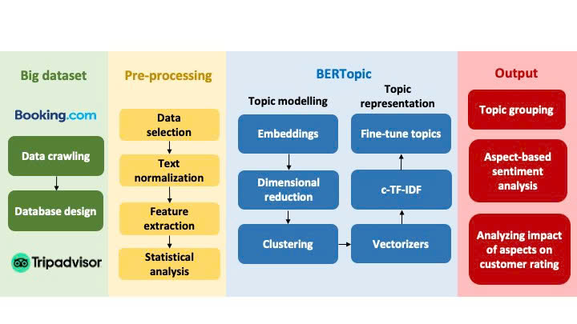

# Manhos

## Introduction 

This study developed an efficient BERTopic-based topic modeling on bigdata online reviews to analyze simultaneously five key aspects of customer sentiment. A dataset was collected from social online platform like Booking or TripAdvisor. Extension of the present work to other online platforms is straightforward. 

## Methodology
Flowchart of present work.

## Dataset

Data was collected from Booking and TripAdvisor, which will be updated on request from reviewers.

## Annotated data

Will be updated on request from reviewers.

## References

1. Hanh Thi My Le, Thuy-An Phan-Thi, Binh T. Nguyen, Thang Quyet Nguyen (2025).  
   *Mining online hotel reviews using big data and machine learning: An empirical study from an emerging country*.  
   Annals of Tourism Research Empirical Insights, 6(1), 100170.  
   ISSN: 2666-9579.  [DOI: 10.1016/j.annale.2025.100170](https://doi.org/10.1016/j.annale.2025.100170).
2. Le, H. T. M., Nguyen, B. T., & Nguyen, T. Q. (2026). Unlocking insights into customer sentiment analysis: Impact of loyalty on online hotel ratings. International Journal of Hospitality Management (Revised).

