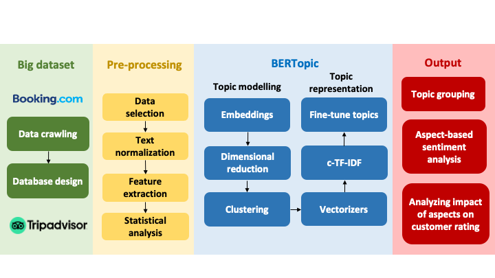

# Manhos

## Introduction 

This research project developed an efficient AI framework to analyze big data online reviews. A dataset was collected from social online platforms, like Booking and TripAdvisor. Extension of the present work to other online platforms is straightforward. The BERTopic-based approach was to extract five novel aspects (facility, amenity, service, experience value and loyalty). To enhance construct validity, human-labeled sentiment analysis is combined. Econometric techniques connect aspect-based sentiment with individual ratings within the S-O-R framework. Loyalty-related intentions are strongly associated with higher ratings, which exhibits their mediating role between service delivery and brand equity.

## Methodology

General flowchart of the present work.

## Dataset

Data was collected from Booking and TripAdvisor, which will be updated on request from reviewers.

## Annotated data

Will be updated on request from reviewers.

## Reprints

1. Hanh Thi My Le, Thuy-An Phan-Thi, Binh T. Nguyen, Thang Quyet Nguyen (2025).  
   *Mining online hotel reviews using big data and machine learning: An empirical study from an emerging country*.  
   Annals of Tourism Research Empirical Insights, 6(1), 100170.  
   ISSN: 2666-9579.  [DOI: 10.1016/j.annale.2025.100170](https://doi.org/10.1016/j.annale.2025.100170).
2. Hanh Thi My Le, Binh T. Nguyen & Thang Q. Nguyen (2026). Unlocking insights into customer sentiment analysis: Impact of loyalty on online hotel ratings. International Journal of Hospitality Management, Revised.

